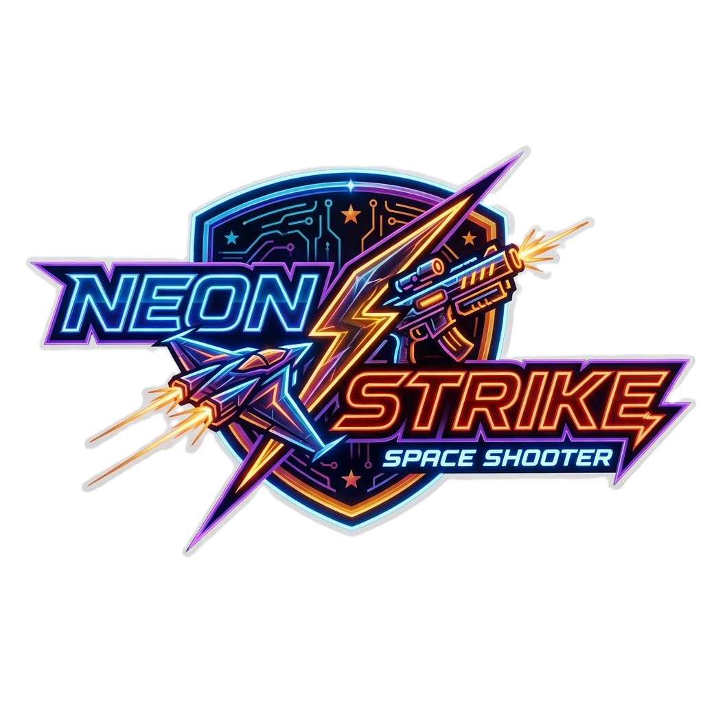

# Neon Strike

A modern, fast-paced top-down arena shooter (Vue 3 + Vite + Tailwind CSS + Canvas).

Survive escalating waves, chain kills for combos, grab buffs from special enemies, and clear the field with missiles / shockwave / dash.



## Setup and Run

Requires Node.js >= 18.

```bash
npm install
npm run dev      # http://localhost:5173
npm run build    # production build -> dist/
npm run preview  # preview production build
npm test         # vitest unit tests
```

## Firebase setup (auth + Firestore)

The app uses Firebase Authentication (email/password) and Cloud Firestore
(global scores, multiplayer race rooms, presence, invites). No database URL
is needed — Firestore resolves from the project id. One-time console setup:

1. Go to [Firebase Console](https://console.firebase.google.com/) → project
   `shooter-game-cf98f` (config lives in `src/game/firebase.js`).
2. **Authentication → Sign-in method** → enable **Email/Password**.
3. **Firestore Database → Create database** → Start in **production mode**,
   pick any location → Enable.
4. **Firestore Database → Rules** → paste the contents of
   `firestore.rules` from this repo → Publish.

Flow: login/register (or Continue offline) → menu
(Single player / Multiplayer race / Settings) → ship hangar → arena.
Multiplayer rooms race live scores — everyone flies their own run at the
same time; host starts, standings update live, results when all finish.

Database layout:

```
users/{uid}  = { name, email, createdAt, gamesPlayed, bestScore }
scores/…     = { uid, name, score, wave, kills, timeSec, ts }
rooms/{CODE} = { host, status, members: {uid: {name, ready, ship}}, live: {...} }
status/{uid} = { name, lastSeen }  (presence heartbeats)
invites/{uid}/items/… = { fromUid, fromName, roomCode, mode, ts }
```

## Controls

| Input | Action |
|---|---|
| **WASD / Arrows** | Move (normalized diagonals) |
| **Mouse** | Aim |
| **Left Click / Space (hold)** | Fire plasma (hold to auto-fire) |
| **Shift** | Dash — invincible, kills on contact (2 charges, ~1.2s recharge) |
| **C** | Homing missiles (5s, 20 when Skill buff) |
| **E** | Shockwave — heavy radial damage + knockback (15s) |
| **P / Esc** | Pause / resume |
| **M** | Mute / unmute |
| Touch | Left virtual stick to move, right side drag to aim, buttons to fire/dash/missiles/shock |

Kills charge a combo multiplier (up to x5). Taking damage resets combo.
Special enemies drop buffs / pickups:

* **Gold hexagon** → Skill Enhanced (triple shot, faster cooldowns)
* **Cyan square** → Infinite Ammo (no energy cost, faster regen)
* **Green cross** → Repair (+30 integrity)
* **Violet triangle** → Magnet (pickup attraction) — boss waves

Boss every 5 waves: large, high HP, radial burst.

## Architecture

```
src/
  game/
    constants.js  # tunables, palette, enemy defs, wave director tables
    engine.js     # pure simulation (no DOM), tick-based, fixed 60Hz
    renderer.js   # canvas + minimap drawing (culled, pooled particles)
    audio.js      # WebAudio synth SFX, no assets
  composables/
    useGame.js        # loop, input, pause, touch, settings wiring
    useLeaderboard.js # localStorage top-10 with validation
    useSettings.js    # volume/shake/fps/mute persisted settings
    useAuth.js        # Firebase email/password auth + offline mode
    useCloudBoard.js  # global top-10 scores in RTDB
    useRoom.js        # multiplayer race rooms in RTDB
  components/
    AuthScreen.vue, MainMenu.vue, SettingsScreen.vue, RoomsScreen.vue,
    RacePanel.vue, Lobby.vue, GameStage.vue, Hud.vue, AbilityBar.vue,
    Minimap.vue, Banner.vue, StatBar.vue, GameOverOverlay.vue,
    PauseOverlay.vue, SettingsPanel.vue, TouchControls.vue,
    Leaderboard.vue (Local/Global tabs), HowToPlay.vue
```

* Engine never touches DOM. Vue reads a `hud` mirror synced once per frame.
* Simulation is tick-based (`STEP_MS = 1000/60`). Cooldowns are in ticks, not `Date.now()`, so pause/hidden tabs don't desync.
* Legacy single-file prototype archived at `legacy/shootergame.html` — `src/` is source of truth.

## Tuning

All gameplay numbers live in `src/game/constants.js` (`player, bullet, energy, dash, missile, shock, combo, pickups, MAX_PARTICLES, ENEMY_TYPES, BOSS, spawn`).

## Production

* `vite.config.js` uses relative `base`, sourcemaps, Vitest config.
* PWA manifest at `public/manifest.webmanifest`.
* CI: `.github/workflows/ci.yml` runs `npm test` + `npm run build`.
* Scores stored locally (`neonStrike_leaderboard_v2`, top 10) + global top 10
  in Firestore (`scores`) for signed-in players.
* Firestore security rules ship as `firestore.rules` — paste into the console.

## Roadmap

* [x] Tick cooldowns, dash charges, combo, pickups, boss
* [x] Firebase auth, global leaderboard, multiplayer race rooms
* [ ] Shared-arena realtime PvP, replays, more biomes
